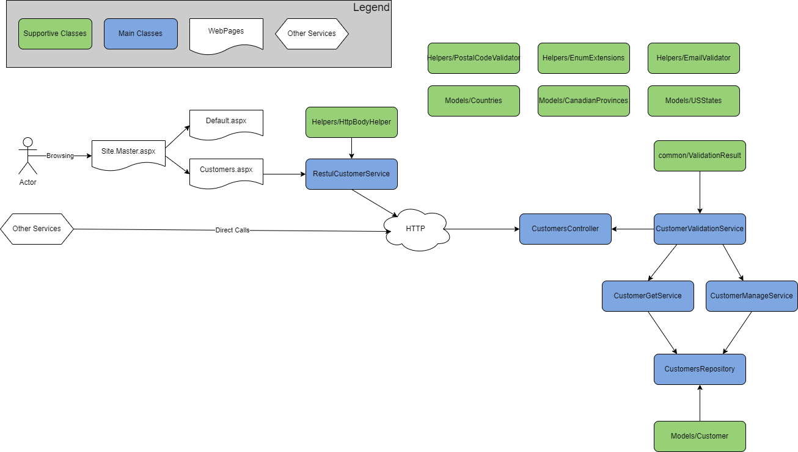

# API Developer Assessment

## Notes

* in general majority of my time was spent on realization of "how to do it within the C# project". In case there is a working application which can be referenced to - it will simplify the process and speedup the timeline dramatically
* not sure if my implementation is correct. As I understood this assessment generates the dll library. I've implemented internal methods to setup the local restful interface and startup the site on run.
* refactored the form item names to keep the type of the objects in front of the IDs (camelCase).
* faced with the GitKraken bug when it removes the current branch and modified files if some of the files are blocked and you are switching to another branch.
* added test cases using AI. Will check them all later to revise the code behind. Almost all processes fine except a few performance-related ones.

## High level site map

## Applied Changes

### Models

* removed unnecessary CustomerDBContext model as we are working with the local list as a mock
* fixed the lists in the Models
* extracted model classes to stay aligned with the SOLID principles

### Controllers

* Created a new controller to manage OpenApi requests

### Services

#### CustomersService

* renamed the CustomersService to CustomerService

#### ApiCustomerService

* Added new ApiCustomerService

### Customers.aspx

* fixed the CodeBehind
* aligned the page with the master-content principle (like default.aspx)
* fixed the customer notes field
* added a new label to handle the output messages and make the page more interactive
* added 2 missing fields for customer contact
* removed the direct service call (decoupled from the CustomerService)
* implemented the WebApiCalls through the newly added service called RestfulCustomerService
* implemented ddlCustomers selection change method (to add new or update existing customer)
* added new button to delete the customer
* implemented ddlCountries selection change method (to populate the states/provinces with the proper list)
* added validation for the CustomerEmail and CustomerPhone fields
